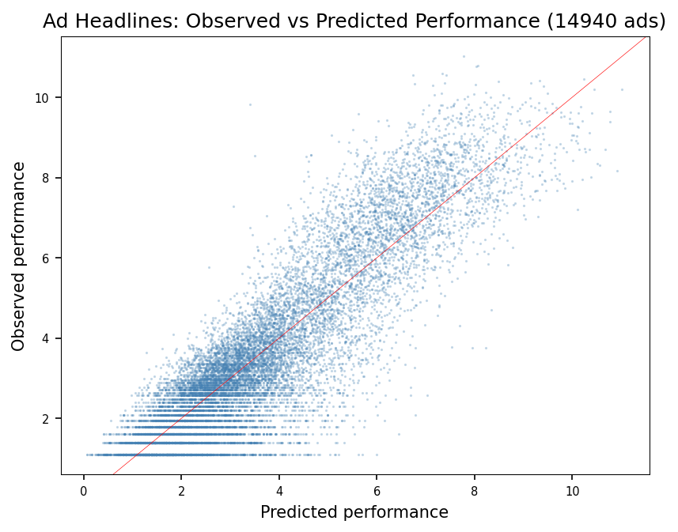
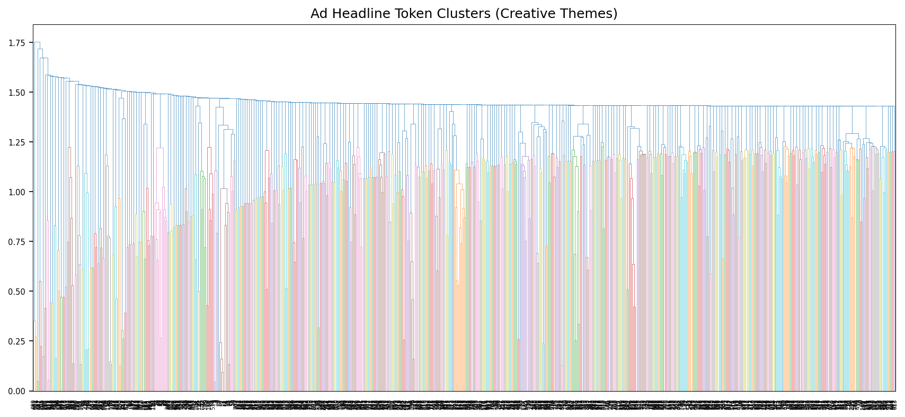

# Ad Creative Scoring — Token-Based Headline Performance Prediction

Predicting ad headline click performance using token-based scoring — no neural networks or LLM API calls. Break headlines into tokens (words, bigrams, trigrams, co-occurring pairs), score each by historical click correlation, then predict performance of new headlines from their components.

## Approach

Adapted from Vincent Granville's NLP scoring algorithm (Section 8.3.3, GenAITechLab).

1. **Tokenize** — each headline is split into single words, adjacent bigrams/trigrams (`word1~word2`), and co-occurring pairs (`word1^word2`)
2. **Score** — every token gets an average performance score based on all headlines containing it
3. **Predict** — a headline's predicted performance is the inverse-frequency-weighted average of its token scores (rare tokens = less weight, not more)
4. **Cluster** — high-performing tokens are grouped into "creative themes" using Jaccard similarity and agglomerative clustering

## Dataset

Uses Microsoft's [MIND](https://msnews.github.io/) (Microsoft News Dataset) — 14,940 news headlines with real impression and click data — as a structural proxy for ad headlines. Performance metric: `impressions * (1 + 10 * CTR)`.

## Results

| Metric | Value |
|--------|-------|
| Headlines scored | 14,940 |
| Unique tokens extracted | 765K+ |
| Correlation (predicted vs observed) | 0.887 |
| Mean absolute error | 0.742 |





## Quick Start

```bash
pip install pandas numpy scikit-learn scipy matplotlib

python ad_scoring.py
```

## How It Handles Small Samples

A common concern: ads with few impressions and lucky clicks can show inflated CTRs. The algorithm mitigates this through:

- **Minimum count thresholds** — tokens must appear in 15+ headlines (6+ for bigrams) to enter analysis
- **Inverse-frequency weighting** — `weight = (1/count)^2.0`, so rare tokens contribute less to predictions
- **Log-transform** — `log(performance)` compresses outliers, preventing low-impression flukes from dominating
- **Category fallback** — when no tokens have enough signal, predictions fall back to the vertical average

For production use, you'd also want minimum impression floors on the ads themselves and confidence intervals on token scores.

## Using With Real Campaign Data

1. Export ad headlines + impressions + clicks from your DSP
2. Compute performance: `impressions * (1 + 10 * CTR)` or use revenue
3. Format as tab-separated: `Title \t URL \t Author \t Page views \t Creation date \t Status`
4. Replace `Ad-Performance.txt` with your file
5. Adjust `compress_vertical()` for your verticals
6. Re-run `ad_scoring.py`

## Inspiration

- Vincent Granville, *GenAITechLab Taxonomy LLM* — [Section 8.3.3: Predicting article pageviews](https://github.com/VincentGranville/Large-Language-Models/tree/main/xllm6)
- Microsoft MIND dataset — [msnews.github.io](https://msnews.github.io/)
